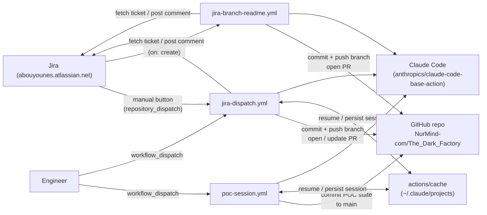
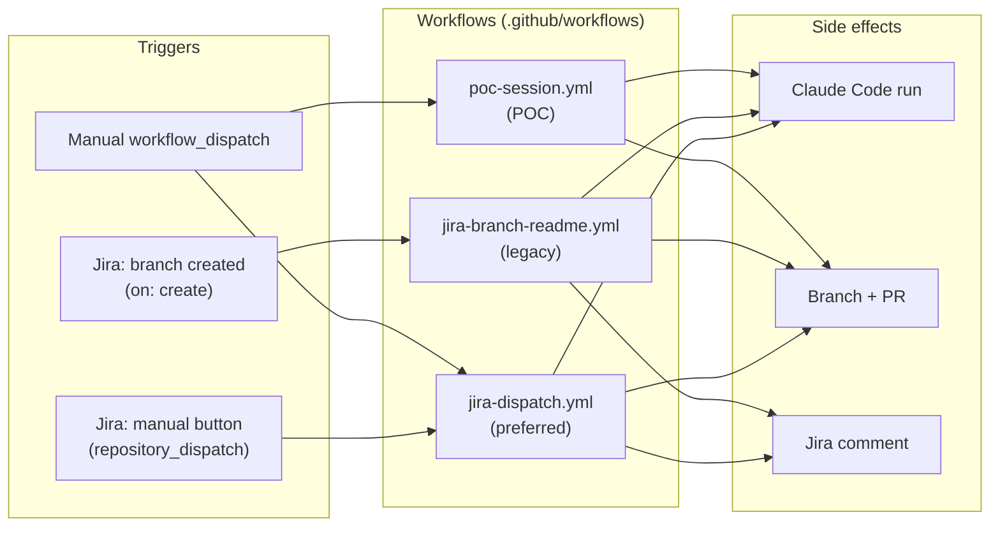
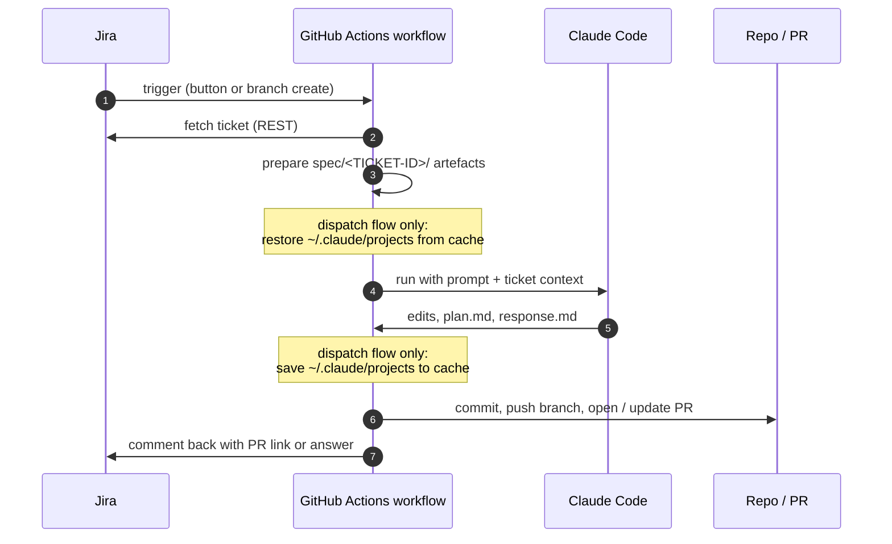

# Workflows Overview

A very high level view of how Jira tickets become repository changes in The Dark Factory.

The source of truth for behaviour is always the workflow files themselves under
[`.github/workflows/`](../.github/workflows). For a deeper spec of the dispatch
flow and Claude session continuity, see
[`../github_actions_claude_spec.md`](../github_actions_claude_spec.md).

## Workflows in this repo

| Workflow | Trigger | Purpose | Status |
|---|---|---|---|
| [`jira-dispatch.yml`](../.github/workflows/jira-dispatch.yml) | `repository_dispatch: jira_manual_button` from Jira automation, or manual `workflow_dispatch` | Turn a Jira ticket into reviewable repo work or a Jira-facing answer. Resumes Claude across runs. | Preferred |
| [`jira-branch-readme.yml`](../.github/workflows/jira-branch-readme.yml) | Branch creation (`on: create`) | One-shot: when Jira creates a branch, generate a spec, run Claude once, open a PR. No session continuity. | Legacy, kept for compatibility |
| [`poc-session.yml`](../.github/workflows/poc-session.yml) | Manual `workflow_dispatch` | Proof-of-concept that Claude Code sessions can be resumed across runner invocations. | POC only |

## High level system view (V1)

> Original diagram. Kept for reference. The label crowding in the middle
> ("resume / persist session" stacked over "commit + push branch / open PR" and
> "commit POC state to main") motivated the V2 redraw below.



## High level system view (V2)

Same information re-laid as a three-lane swimlane: **Triggers → Workflows →
Side effects**. Trigger metadata moves into the trigger nodes (so the
arrows can stay unlabelled), and there are no bidirectional edges between
the same node pair (those were the source of the stacked-label collisions in
V1). The `actions/cache` is omitted here — it is an implementation detail of
session continuity and is captured in the workflow comparison table above.



## Common shape of a Jira-driven run

Both `jira-dispatch.yml` and `jira-branch-readme.yml` follow the same overall
shape, just with different trigger semantics and different artefact layouts.
`jira-dispatch.yml` adds session-cache restore/save around the Claude step.



## Artefacts each run produces

```
spec/<TICKET-ID>/
  spec.md          ticket snapshot (refreshed each run)
  plan.md          implementation plan owned by Claude
  response.md      Jira-facing summary or answer
  state.json       last_session_id, run_count, kind
  transcript.md    one section per run
  runs/<ts>-<id>/  per-run prompt and response copies
```

The legacy `jira-branch-readme.yml` flow uses the older flat layout
(`spec/<KEY>-<slug>.md` and `<KEY>-<slug>-plan.md` at repo root) for backwards
compatibility.
